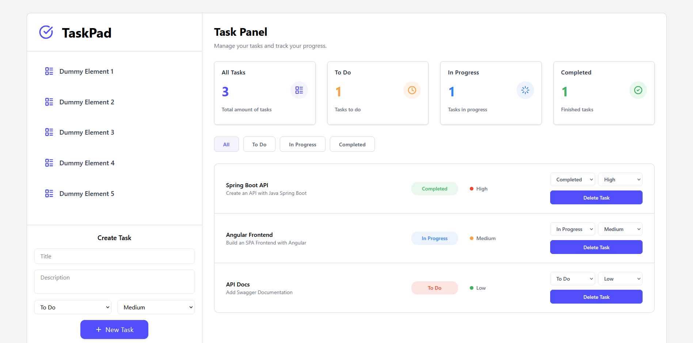
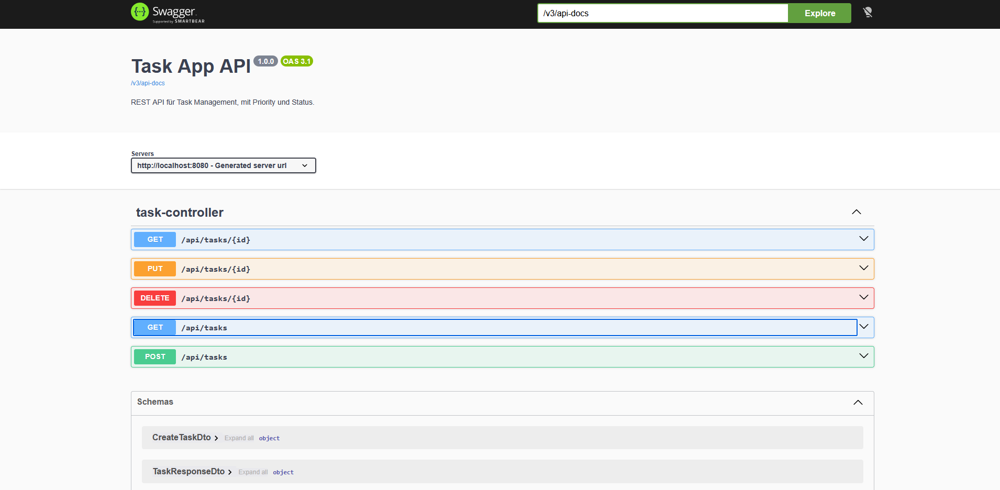

# Task Management API

Eine Full-Stack Task-Management-Anwendung mit Angular-Frontend und Spring-Boot-Backend.

Das Projekt zeigt eine typische mehrschichtige Architektur mit REST API, DTOs, Validierung, Exception Handling, Status-Filterung, CRUD-Funktionen, PostgreSQL-Persistenz und interaktiver API-Dokumentation über Swagger / OpenAPI.

## Screenshots

### Dashboard



### Swagger API Documentation



## Tech Stack

### Frontend

- Angular 21.2
- TypeScript 5.9
- Tailwind CSS 4
- Angular Signals
- Angular HttpClient
- RxJS

### Backend

- Java 17
- Spring Boot 4.1
- Gradle
- Spring Web
- Spring Data JPA
- PostgreSQL
- Docker Compose
- Jakarta Validation
- Lombok
- Swagger / OpenAPI mit Springdoc 3.0.3
- Spring Boot Actuator
- Testcontainers mit PostgreSQL

## Features

### Task-Funktionen

- Tasks erstellen
- Tasks anzeigen
- Tasks nach Status filtern
- Status einer Task aktualisieren
- Priorität einer Task aktualisieren
- Tasks löschen

### Backend-Funktionen

- REST API mit Spring Boot
- Mehrschichtige Architektur: Controller → Service → Repository → Datenbank
- Request DTOs und Response DTOs
- Validierung eingehender Daten
- Globales Exception Handling
- Status-Filterung über Query Parameter
- Persistenz mit Spring Data JPA und PostgreSQL
- Lokale Datenbank über Docker Compose
- Konfiguration über Spring Profiles und Environment Variables
- Swagger / OpenAPI Dokumentation
- Health Endpoint über Spring Boot Actuator
- Integration Tests mit PostgreSQL Testcontainers

### Frontend-Funktionen

- Angular Standalone Components
- Wiederverwendbare Komponenten
- Service Layer für API-Kommunikation
- State Management mit Angular Signals
- Dynamische Filterung nach Task-Status
- Formularvalidierung im Frontend
- Tailwind CSS Styling

## Projektstruktur

```text
task-app/
├── backend/
└── frontend/
```

## Backend-Architektur

```text
Controller
    ↓
Service
    ↓
Repository
    ↓
Database
```

Die Backend-Architektur trennt HTTP-Logik, Businesslogik und Datenbankzugriff voneinander.

- Controller nehmen HTTP-Requests entgegen.
- Services enthalten die Anwendungslogik.
- Repositories übernehmen den Datenbankzugriff.
- DTOs trennen API-Daten von Entity-Daten.
- Exception Handler liefern kontrollierte Fehlerantworten.

## Frontend-Architektur

```text
Component
    ↓
Service
    ↓
REST API
```

Das Frontend nutzt Angular Components für die UI und Angular Services für die Kommunikation mit dem Spring-Boot-Backend.

## Voraussetzungen

Für die lokale Ausführung werden folgende Komponenten benötigt:

- Java JDK 17 für das Spring Boot Backend
- Node.js 22 LTS für das Angular Frontend
- npm, wird mit Node.js installiert
- Docker Desktop oder Docker Engine

## Lokale Datenbank starten

Das Projekt nutzt PostgreSQL für die lokale Entwicklung. Die Datenbank wird über Docker Compose gestartet.

Im Projekt-Root:

`docker compose up -d`

Dadurch wird ein PostgreSQL-Container gestartet.

Standardwerte für die lokale Datenbank:

```
Database: taskmanager
Username: taskuser
Password: taskpassword
Port: 5432
```

Falls die Container neu gebaut werden sollen:

`docker compose up -d --build`

Falls die Container gestoppt werden sollen:

`docker compose down`

## Backend-Konfiguration

Das Backend nutzt Spring Profiles und Environment Variables.

Die lokale Entwicklungsumgebung verwendet Standardwerte, falls keine Environment Variables gesetzt sind:

```
spring.datasource.url=${DB_URL:jdbc:postgresql://localhost:5432/taskmanager}
spring.datasource.username=${DB_USERNAME:taskuser}
spring.datasource.password=${DB_PASSWORD:taskpassword}

spring.jpa.hibernate.ddl-auto=${DDL_AUTO:update}
spring.jpa.show-sql=${SHOW_SQL:true}
spring.jpa.properties.hibernate.format_sql=true
```

Dadurch kann das Backend lokal direkt mit der Docker-PostgreSQL-Datenbank gestartet werden.

## Backend starten

Im Backend-Ordner:

```
cd backend
./gradlew bootRun
```

Auf Windows:

```
cd backend
.\gradlew bootRun
```

Backend läuft standardmäßig unter:

http://localhost:8080

## Frontend starten

Im Frontend-Ordner:

```
cd frontend
npm install
npm start
```

Frontend läuft standardmäßig unter:

http://localhost:4200

## API-Dokumentation

Nach dem Start des Backends ist die Swagger UI erreichbar unter:

```text
http://localhost:8080/swagger-ui/index.html
```

Die OpenAPI JSON-Dokumentation ist erreichbar unter:

```text
http://localhost:8080/v3/api-docs
```

## Health Check

Das Backend stellt über Spring Boot Actuator einen Health Endpoint bereit:

http://localhost:8080/actuator/health

## Tests

Das Backend nutzt Testcontainers, um Integration Tests gegen eine echte PostgreSQL-Testdatenbank auszuführen.

Tests lokal starten:

```
cd backend
./gradlew test
```

Auf Windows:

```
cd backend
.\gradlew test
```

Während der Tests startet Testcontainers automatisch einen PostgreSQL-Container. Docker muss dafür lokal laufen.

## Beispiel-Endpunkte

```http
GET /api/tasks
```

Lädt alle Tasks.

```http
GET /api/tasks?status=TODO
```

Lädt Tasks mit dem Status `TODO`.

```http
POST /api/tasks
```

Erstellt eine neue Task.

```http
PUT /api/tasks/{id}
```

Aktualisiert eine vorhandene Task.

```http
DELETE /api/tasks/{id}
```

Löscht eine Task.
